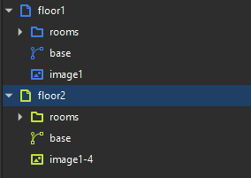
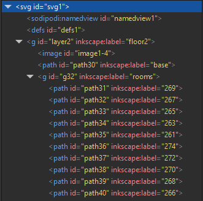

# SVG план корпуса

Объекты `корпус` и `помещение` добавляются в систему на основе парсинга svg-плана корпуса. Чтобы этот процесс прошёл корректно, план корпуса должен соответствовать определённой структуре xml-документа.

## Инструменты

Для создания плана корпуса подходят любые вектоорные графические редакторы, поддерживающие экспорт документов в формате svg и добавление xml-аттрибутов объектам рисунка.

В качестве примера, можно рекомендовать бесплатный редактор *Inkscape*.

## Слои и группировки

План корпуса содержится в едином svg-документе. Для разделения планов отдельных этажей следует использовать слои. План каждого этажа рисуется на отдельном слое.

Внутри слоя, однотипные объекты (комнаты, стены) рекомендуется объединять в группы для удобства навигации. Принципиально важно, чтобы все помещения, относящиеся к этажу, располагались строго внутри слоя соответствующего этажа. Так это выглядит в редакторе и в xml-структуре документа соответственно:

## Теги и атрибуты

Для определения объекта на схеме используются xml-атрибуты. Такой подход не накладывает строгое ограничение на структуру документа и позволяет избежать конфликтов со служебными атрибутами и тегами, создаваемыми графическим редактором. За счёт этого достигается относительная свобода в выборе используемых инструментов и стиля работы в графическом редакторе.

### `type`*

Ключевой атрибут `type` определяет тип объекта схемы. Принимает следующие значения:
- floor
- room

У неключевых объектов не прописывается. Т.е не требуется указывать атрибут у фигур стен и т.п.

### `floor_level`*

Атрибут, наличие которого обязательно у объектов типа `floor`. Содержит целое число, обозначающее номер этажа.

### `room_name`

Атрибут указывается у объектов типа `room`. Содержит наименование помещения. При отсутствии атрибута, помещению присваивается имя по умолчанию.

Пример: `Переговорная`, `Аудитория №406`.

## Общие рекомендации

\*В разработке\*

## Пример

[Пример схемы ](/docs/examples/example_unit.svg)